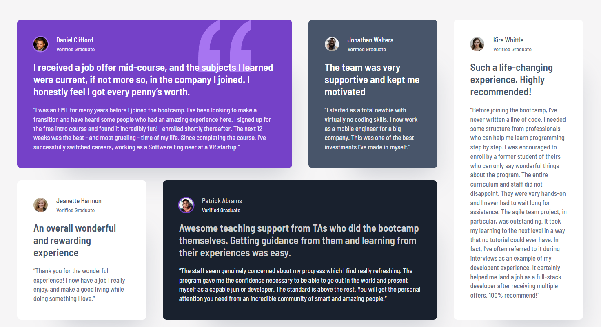

# Frontend Mentor - Meet landing page solution

This is a solution to the [Meet landing page challenge on Frontend Mentor](https://www.frontendmentor.io/challenges/meet-landing-page-rbTDS6OUR). Frontend Mentor challenges help you improve your coding skills by building realistic projects.

## Table of contents

- [Overview](#overview)
    - [The challenge](#the-challenge)
    - [Screenshot](#screenshot)
- [My process](#my-process)
    - [Built with](#built-with)
    - [What I learned](#what-i-learned)
    - [Continued development](#continued-development)
    - [Useful resources](#useful-resources)
    - [AI Collaboration](#ai-collaboration)

## Overview

### The challenge

Users should be able to:

- View the optimal layout depending on their device's screen size

### Screenshot



### Links

Live site URL [FEM testimonial grid section](https://andreajrujano.github.io/fem-testimonial-grid-section/)

## My process

### Built with

- Semantic HTML5 markup
- CSS custom properties
- Flexbox
- CSS Grid
- Mobile-first workflow


### What I learned

#### Perfect usage for CSS-grid

The testimonial card arrangement is a perfect example that can be achieved using CSS grid. For example, in desktop the grid has 2 rows and 4 columns and Kira's card span the whole vertical space and the last column
```css
    .testimonial--kira {
        grid-column: 4 / 5;
        grid-row: 1 / 3;
    }
```
This can also be achieved using `span`:
```css
    .testimonial--kira {
        grid-column: 4 / 5;
        grid-row: 1 / span 2;
    }
```

#### Using images as background

The Daniel's card has a quote image in the background, the pattern to achieve this is

```css
    .testimonial--daniel {
        background-image: url('bg-pattern-quotation.svg');
        background-repeat: no-repeat;
        background-position: top 0 right 80px;
        background-size: 104px 102px;
    }
```
The `url` function used in `background-image` loads the svg graphic as a CSS background decoration instead of an `` element.

This decorative icon does not need semantic meaning, hence it won't need a semantic tag.

Property `background-repeat` has by default behaviour to repeat the image as tile horizontally and vertically to fill their container. With the value `no-repeat` this behavior is avoided.

The property `background-position` controls where the image sits inside the card container. It has many possibilities, the current values used were to place the image right behind the headline and avatar text, since
- `top 0` aligns the graphic to the top edge of the card.
- `right 80px` pushes the graphic 80px to the left of the right edge

Finally, the property `background-size` with value `104px 102px` defines the dimensions preventing the SVG from rendering at its full original size.

#### Accessible Outline (sr-only)

Implemented an `<h1>` heading wrapped in a `.sr-only` class to establish a proper document outline for screen readers without altering the visual design layout.

#### Headings vs. Quotes

Utilized `<h2>` for user names (card primary identifier), `<h3>` for headline hooks, and `<blockquote>` for testimonial content to maintain semantic integrity.

#### Figma-to-CSS Drop Shadows

Translated Figma box-shadow parameters ($X$, $Y$, Blur, Spread, Opacity) into valid CSS properties:
```css
.testimonial {
    box-shadow: 40px 60px 50px -47px rgba(72, 85, 106, 0.24);
}
```
Negative spread (-47px) was key to shrinking the shadow footprint and creating modern depth under floating elements.

#### Viewport Centering

Fixed layout collapsing issues by adding `min-height: 100vh` to `<main>` and using `display: grid; place-items: center;` to keep container elements centered regardless of off-screen `position: absolute` accessibility tags.

### Continued development

Get to understand better the background images properties and values in CSS.

Further and advanced uses for CSS grid.

### Useful resources

- [MDN docs](https://developer.mozilla.org/en-US/) - This helped me to explore the background image properties

### AI Collaboration

I used Gemini to

- understand how to apply the box shadow property from the figma design specifications. 
- review why the main was collapsing
- general review of the html structure after first implementation to improve accessibility and well-used semantic tags.


